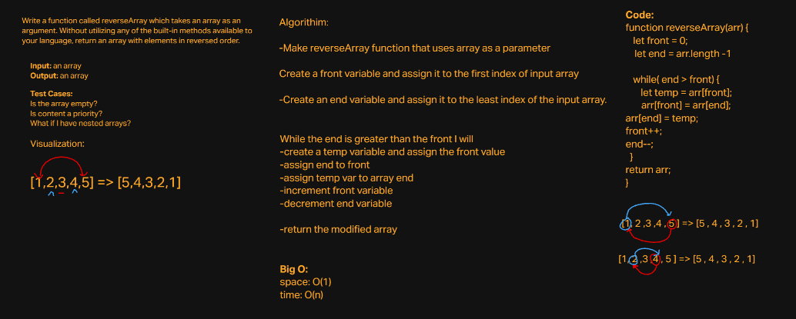
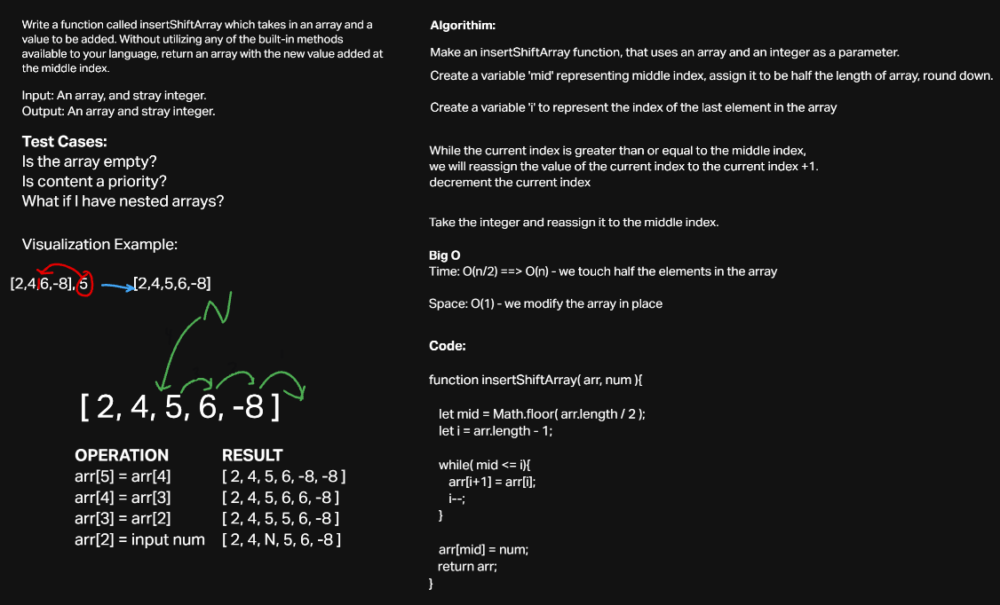
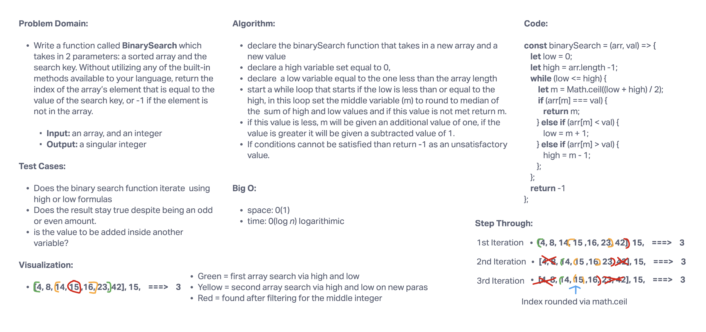

# Data Structures and Algorithms

See [setup instructions](https://codefellows.github.io/setup-guide/code-301/3-code-challenges), in the Code 301 Setup Guide.

## Repository Quick Tour and Usage

### 301 Code Challenges

Under the `javascript` folder, at the top level, is a sub-folder called `code-challenges`

Each day, you'll add one new file to this folder to do your work for the day's assigned code challenge

If you have not already done so, run `npm install` from within this folder to setup your system to be able to run tests using `Jest`

To run your tests

- Change to the `javascript` folder
- run `npm test` to run all of the tests
- run `npm test ##` to only run tests for challenge ## (i.e. 01)

### 401 Data Structures, Code Challenges

# Reverse an Array

Write a function called reverseArray which takes an array as an argument. Without utilizing any of the built-in methods available to your language, return an array with elements in reversed order.

## Whiteboard Process

## Approach & Efficiency

This code challenge was solved using a while loop and assigning temporary values, while subtracting and adding to these temporary variables assigned to the the ends to essentially 'flip' the front and back of the array.

   So essentially the approach that I applied was deconstructing the code challenge and using core logic itself. I knew that I couldn't use any built in methods so that limited me back to the basics!

   The Big O: space is O(1)
   while the time is O(n)

   ****I followed along in class and disected the problem to ultimately solve this code challenge.** **

   # insertShiftArray

   Write a function called insertShiftArray which takes in an array and a value to be added. Without utilizing any of the built-in methods available to your language, return an array with the new value added at the middle index.

## Whiteboard Process

## Approach & Efficiency

This coding problem required me to create a function, pre define an array and a number as aswell. I created a while loop to continue as long as the mid variable is less than or equal i, the index of i will be shifted over and reassigned. Then the remainig integers will also be subtracted by 1, for each iteration. The mid variable will then be reassigned to the num's value. I will then return the array.

   The Big O: space is O(1)
   while the time is O(n/2)

   # BinarySearchArray

Write a function called BinarySearch which takes in 2 parameters: a sorted array and the search key. Without utilizing any of the built-in methods available to your language, return the index of the array’s element that is equal to the value of the search key, or -1 if the element is not in the array.
NOTE: The search algorithm used in your function should be a binary search.
Check the Resources section for details

## Whiteboard Process

## Approach & Efficiency

Declare the binarySearch function that takes in a new array and a new value declare a high variable set equal to 0, declare  a low variable equal to the one less than the array length start a while loop that starts if the low is less than or equal to the high, in this loop set the middle variable (m) to round to median of the  sum of high and low values and if this value is not met return m.if this value is less, m will be given an additional value of one, if the value is greater it will be given a subtracted value of 1.
If conditions cannot be satisfied than return -1 as an unsatisfactory value.

   The Big O: space is O(1)
   while the time is O(log n) logarithimic

# Singly Linked List

## Challenge
Create a Linked List class
Within your Linked List class, include a head property.
Upon instantiation, an empty Linked List should be created.
The class should contain the following methods
insert
Arguments: value
Returns: nothing
Adds a new node with that value to the head of the list with an O(1) Time performance.
includes
Arguments: value
Returns: Boolean
Indicates whether that value exists as a Node’s value somewhere within the list.
to string
Arguments: none
Returns: a string representing all the values in the Linked List, formatted as:
"{ a } -> { b } -> { c } -> NULL"

## Approach & Efficiency
I'm not sure to be honest what kind of approach that I could take with a Linked list, even after reviewing it I still don't get how a linked list works. Nothing clicked for me and making a test for each one of these test parameters seems like an impossible task. I JUST DONT GET IT. It all still seems so foreign to me. Space and efficency would have to be O1 and the time would have to be a 0(n) since it is constant.

