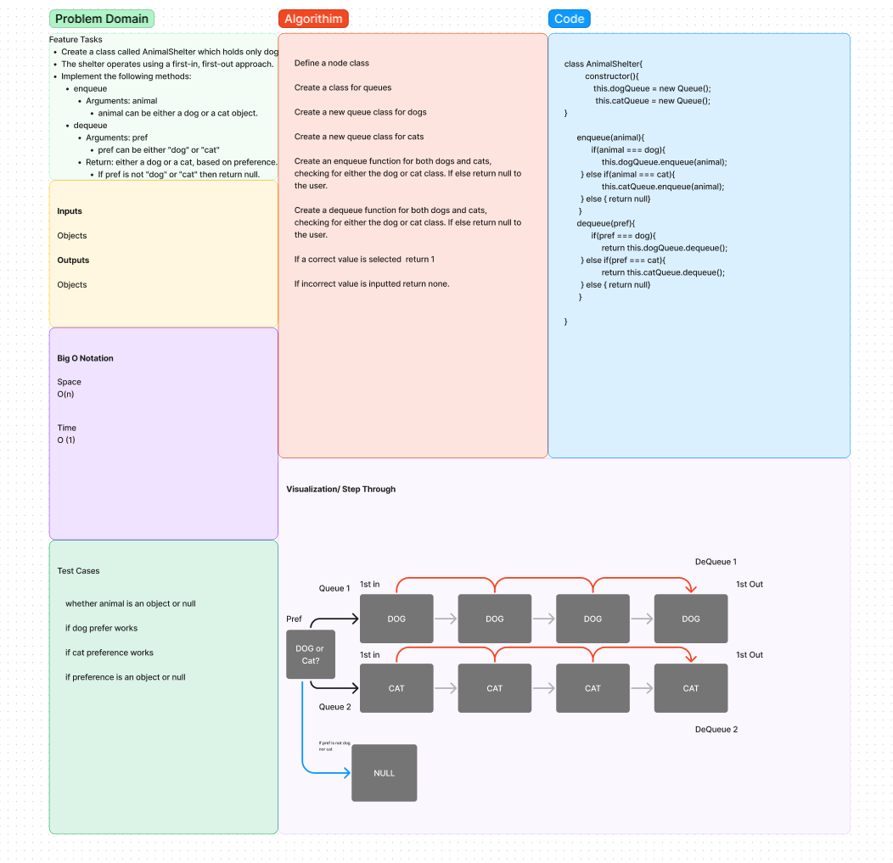
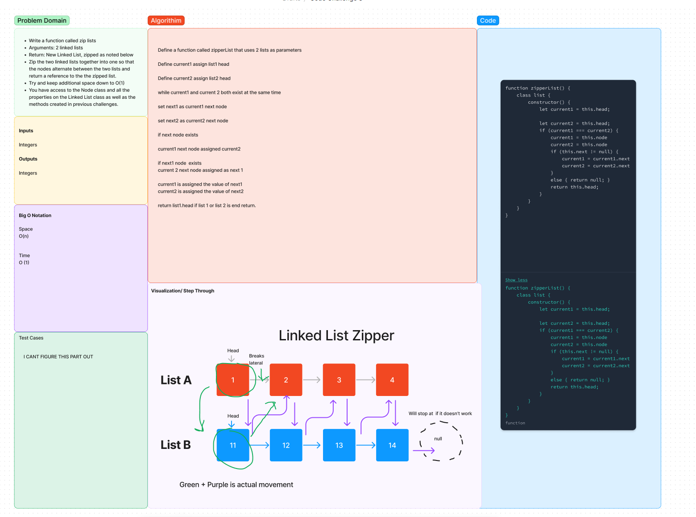
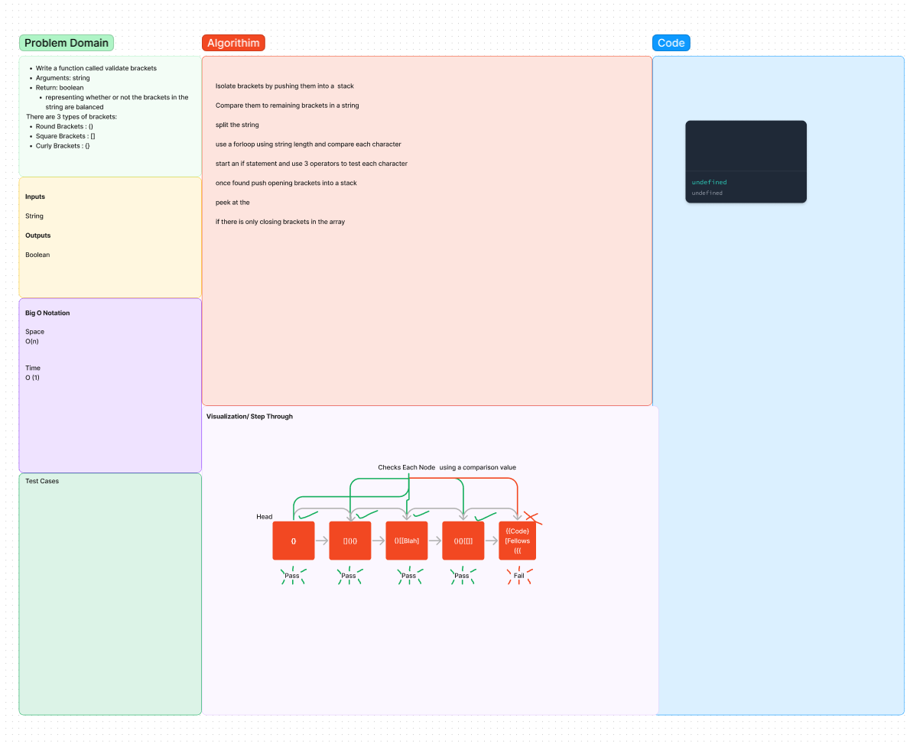

# Data Structures and Algorithms

See [setup instructions](https://codefellows.github.io/setup-guide/code-301/3-code-challenges), in the Code 301 Setup Guide.

## Repository Quick Tour and Usage

### 301 Code Challenges

Under the `javascript` folder, at the top level, is a sub-folder called `code-challenges`

Each day, you'll add one new file to this folder to do your work for the day's assigned code challenge

If you have not already done so, run `npm install` from within this folder to setup your system to be able to run tests using `Jest`

To run your tests

- Change to the `javascript` folder
- run `npm test` to run all of the tests
- run `npm test ##` to only run tests for challenge ## (i.e. 01)

### 401 Data Structures, Code Challenges

# Reverse an Array

Write a function called reverseArray which takes an array as an argument. Without utilizing any of the built-in methods available to your language, return an array with elements in reversed order.

## Whiteboard Process

## Approach & Efficiency

This code challenge was solved using a while loop and assigning temporary values, while subtracting and adding to these temporary variables assigned to the the ends to essentially 'flip' the front and back of the array.

   So essentially the approach that I applied was deconstructing the code challenge and using core logic itself. I knew that I couldn't use any built in methods so that limited me back to the basics!

   The Big O: space is O(1)
   while the time is O(n)

   ****I followed along in class and disected the problem to ultimately solve this code challenge.** **

   # insertShiftArray

   Write a function called insertShiftArray which takes in an array and a value to be added. Without utilizing any of the built-in methods available to your language, return an array with the new value added at the middle index.

## Whiteboard Process

## Approach & Efficiency

This coding problem required me to create a function, pre define an array and a number as aswell. I created a while loop to continue as long as the mid variable is less than or equal i, the index of i will be shifted over and reassigned. Then the remainig integers will also be subtracted by 1, for each iteration. The mid variable will then be reassigned to the num's value. I will then return the array.

   The Big O: space is O(1)
   while the time is O(n/2)

   # BinarySearchArray

Write a function called BinarySearch which takes in 2 parameters: a sorted array and the search key. Without utilizing any of the built-in methods available to your language, return the index of the array’s element that is equal to the value of the search key, or -1 if the element is not in the array.
NOTE: The search algorithm used in your function should be a binary search.
Check the Resources section for details

## Whiteboard Process

## Approach & Efficiency

Declare the binarySearch function that takes in a new array and a new value declare a high variable set equal to 0, declare  a low variable equal to the one less than the array length start a while loop that starts if the low is less than or equal to the high, in this loop set the middle variable (m) to round to median of the  sum of high and low values and if this value is not met return m.if this value is less, m will be given an additional value of one, if the value is greater it will be given a subtracted value of 1.
If conditions cannot be satisfied than return -1 as an unsatisfactory value.

   The Big O: space is O(1)
   while the time is O(log n) logarithimic

# Singly Linked List

## Challenge
Create a Linked List class
Within your Linked List class, include a head property.
Upon instantiation, an empty Linked List should be created.
The class should contain the following methods
insert
Arguments: value
Returns: nothing
Adds a new node with that value to the head of the list with an O(1) Time performance.
includes
Arguments: value
Returns: Boolean
Indicates whether that value exists as a Node’s value somewhere within the list.
to string
Arguments: none
Returns: a string representing all the values in the Linked List, formatted as:
"{ a } -> { b } -> { c } -> NULL"

## Approach & Efficiency
I'm not sure to be honest what kind of approach that I could take with a Linked list, even after reviewing it I still don't get how a linked list works. Nothing clicked for me and making a test for each one of these test parameters seems like an impossible task. I JUST DONT GET IT. It all still seems so foreign to me. Space and efficency would have to be O1 and the time would have to be a 0(n) since it is constant.

# Singly Linked List

## Challenge
Create a Linked List class
Within your Linked List class, include a head property.
Upon instantiation, an empty Linked List should be created.
The class should contain the following methods
insert
Arguments: value
Returns: nothing
Adds a new node with that value to the head of the list with an O(1) Time performance.
includes
Arguments: value
Returns: Boolean
Indicates whether that value exists as a Node’s value somewhere within the list.
to string
Arguments: none
Returns: a string representing all the values in the Linked List, formatted as:
"{ a } -> { b } -> { c } -> NULL"

## Approach & Efficiency
I'm not sure to be honest what kind of approach that I could take with a Linked list, even after reviewing it I still don't get how a linked list works. Nothing clicked for me and making a test for each one of these test parameters seems like an impossible task. I JUST DONT GET IT. It all still seems so foreign to me. Space and efficency would have to be O1 and the time would have to be a 0(n) since it is constant.

# linked-list-kth

## Challenge

Write the following method for the Linked List class:
kth from end
argument: a number, k, as a parameter.
Return the node’s value that is k places from the tail of the linked list.
You have access to the Node class and all the properties on the Linked List class as well as the methods created in previous challenges.

## Approach & Efficiency

Define a function called kthFromEnd that takes in a value k as a parameter.
Define current variable pointing to the linked list head.
Define lengthCounter variable set to 1 that gets incremented to find length of the linked list.
Define a while loop to traverse the linked list while there is a current.next to take us to the end of the array.
Increment lengthCounter at each node in the while loop.
Set current to Head.
Define a value distanceFromFront that is the lengthCounter minus the k value to get the node position.
Define a currIndex variable to find our current position.
Create a while loop, that will loop until currIndex reaches the value of distanceFromFront.
Return the value of current.

Big O Notation

Space 01

Logaritimic: O(n^2)

# Singly Linked List

## Challenge
Create a Linked List class
Within your Linked List class, include a head property.
Upon instantiation, an empty Linked List should be created.
The class should contain the following methods
insert
Arguments: value
Returns: nothing
Adds a new node with that value to the head of the list with an O(1) Time performance.
includes
Arguments: value
Returns: Boolean
Indicates whether that value exists as a Node’s value somewhere within the list.
to string
Arguments: none
Returns: a string representing all the values in the Linked List, formatted as:
"{ a } -> { b } -> { c } -> NULL"

## Approach & Efficiency
I'm not sure to be honest what kind of approach that I could take with a Linked list, even after reviewing it I still don't get how a linked list works. Nothing clicked for me and making a test for each one of these test parameters seems like an impossible task. I JUST DONT GET IT. It all still seems so foreign to me. Space and efficency would have to be O1 and the time would have to be a 0(n) since it is constant.

# Stack and Queue animal shelter

## Challenge

Feature Tasks
Create a class called AnimalShelter which holds only dogs and cats.
The shelter operates using a first-in, first-out approach.
Implement the following methods:
enqueue
Arguments: animal
animal can be either a dog or a cat object.
dequeue
Arguments: pref
pref can be either "dog" or "cat"
Return: either a dog or a cat, based on preference.
If pref is not "dog" or "cat" then return null.

## Approach & Efficiency

Define a node class

Create a class for queues

Create a new queue class for dogs

Create a new queue class for cats

Create an enqueue function for both dogs and cats,
checking for either the dog or cat class. If else return null to the user.

Create a dequeue function for both dogs and cats,
checking for either the dog or cat class. If else return null to the user.

If a correct value is selected  return 1

If incorrect value is inputted return none.

## Big O Notation

Time
O (1)

Space
O(n)

## Work Flow

link to: https://www.figma.com/file/FRVBTr5DJm7YogJpKhIS8V/Code-Challenge-12?node-id=4%3A42&t=nCTUanauwHXdzMtZ-0

# Linked List Zipper

## Challenge

Write a function called zip lists
Arguments: 2 linked lists
Return: New Linked List, zipped as noted below
Zip the two linked lists together into one so that the nodes alternate between the two lists and return a reference to the the zipped list.
Try and keep additional space down to O(1)
You have access to the Node class and all the properties on the Linked List class as well as the methods created in previous challenges.

## Approach & Efficiency

Define a function called zipperList that uses 2 lists as parameters

Define current1 assign list1 head

Define current2 assign list2 head

while current1 and current 2 both exist at the same time

set next1 as current1 next node

set next2 as current2 next node

if next node exists

current1 next node assigned current2

if next1 node  exists
current 2 next node assigned as next 1

current1 is assigned the value of next1
current2 is assigned the value of next2

return list1.head if list 1 or list 2 is end return.

## Big O Notation

Time
O (1)

Space
O(n)

## Work Flow

link to: https://www.figma.com/file/uX4x5FUJZtUG5zWy3pB2Jk/Code-Challenge-8?node-id=4%3A53&t=F7xCbcQ2w7HRZWpb-0

# Stack Queue Brackets

Not Finished.

## Challenge

Write a function called validate brackets
Arguments: string
Return: boolean
representing whether or not the brackets in the string are balanced
There are 3 types of brackets:

Round Brackets : ()
Square Brackets : []
Curly Brackets : {}

## Approach & Efficiency

Gave up after an hour

## Big O Notation

Time
O (1)

Space
O(n)

## Work Flow
Isolate brackets by pushing them into a  stack

Compare them to remaining brackets in a string

split the string

use a forloop using string length and compare each character

start an if statement and use 3 operators to test each character

once found push opening brackets into a stack

peek at the

if there is only closing brackets in the array

