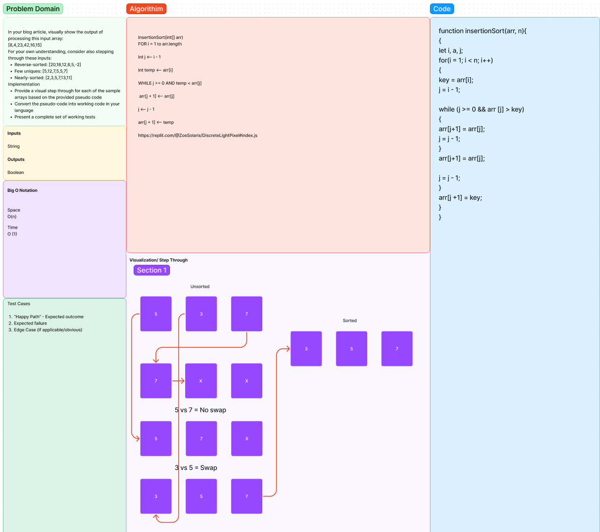

# Challenge Summary

## Insertion Sort

In your blog article, visually show the output of processing this input array:
[8,4,23,42,16,15]
For your own understanding, consider also stepping through these inputs:
Reverse-sorted: [20,18,12,8,5,-2]
Few uniques: [5,12,7,5,5,7]
Nearly-sorted: [2,3,5,7,13,11]
Implementation
Provide a visual step through for each of the sample arrays based on the provided pseudo code
Convert the pseudo-code into working code in your language
Present a complete set of working tests

## Whiteboard Process

## Approach & Efficiency

I took this approach, because it was very difficult to comprehend using only numbers. But using the algorithim given and some youtube guides I can visually and syntactically convert it!

## Solution

function insertionSort(arr, n){
{
let i, a, j;
for(i = 1; i < n; i++)
{
key = arr[i];
j = i - 1;

while (j >= 0 && arr [j] > key)
{
arr[j+1] = arr[j];
j = j - 1;
}
arr[j+1] = arr[j];

j = j - 1;
}
arr[j +1] = key;
}
}
