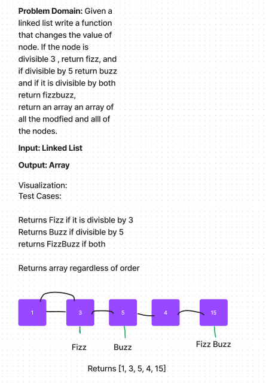

# Fizz Buzz Linked List

Goal was to create a linked list that read Fizz on 3 and Buzz on 5, and FizzBuzz on numbers divisible by both 3, and 5.

Unfortunately I got to the visualization and, COULD NOT GRASP how to translate it from a linked list to a fizz buzz. I did not finish it.

Link to WhiteBoard: https://docs.google.com/spreadsheets/d/1yg7HpxAW__D-umU3LgSDEfwrpAgBeXWPxQD_qgAWC00/edit#gid=2117686990

