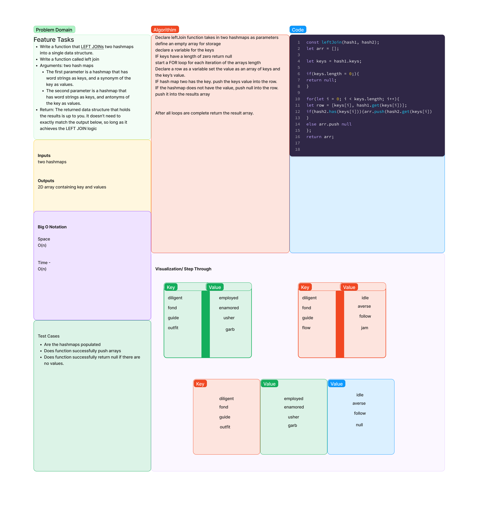

# Hashmap LEFT JOIN
This is a algorithim. That takes keys and associates them by rows depending on what keys are associated with which id.

## Challenge
Write a function called left join
Arguments: two hash maps
The first parameter is a hashmap that has word strings as keys, and a synonym of the key as values.
The second parameter is a hashmap that has word strings as keys, and antonyms of the key as values.
Return: The returned data structure that holds the results is up to you. It doesn’t need to exactly match the output below, so long as it achieves the LEFT JOIN logic

## Approach & Efficiency
Took an approach with my partner seth pierce that will push certain ids through a for loop and an if conditional that will organize all of the information automatically.

## Solution

