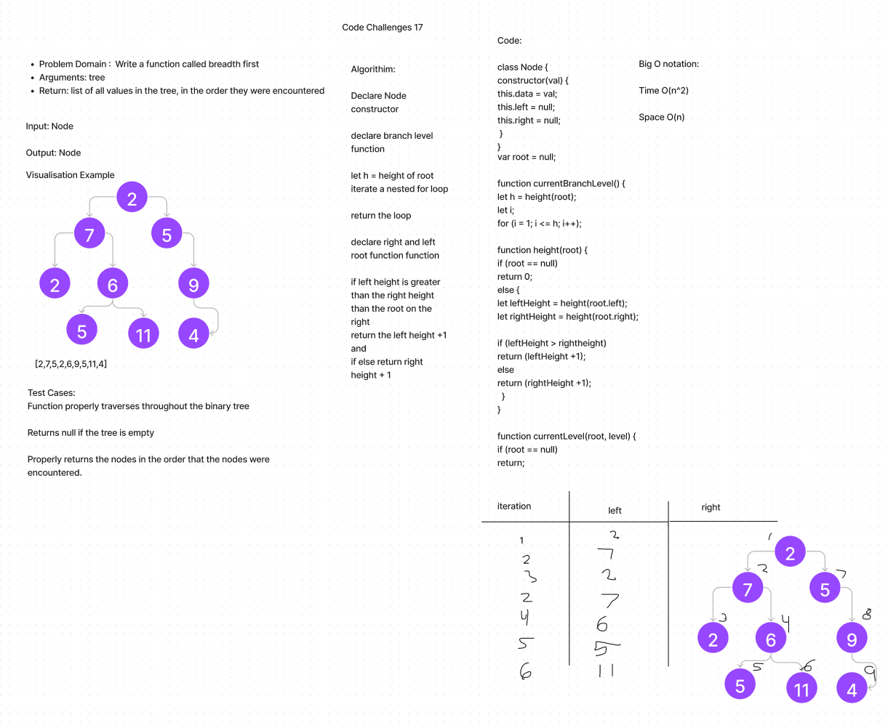

# Tree Breadth Traversal

## Code Challenge 17

Write solution for the Binary Tree Breadth

Input: Node

Output: Node

## Algorithim:

 Declare Node constructor

declare branch level function

let h = height of root
iterate a nested for loop

return the loop

declare right and left root function function

if left height is greater than the right height than the root on the right
return the left height +1 and
if else return right height + 1

## Big O Notation

Time O(n^2)

Space O(n)

## Work Flow

