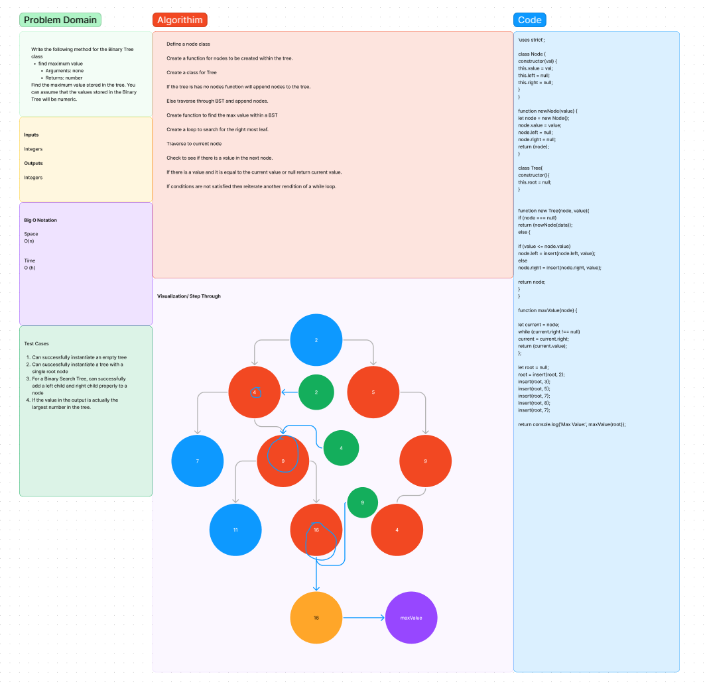

# tree-Max

## Challenge

Write the following method for the Binary Tree class

find maximum value

Arguments: none

Returns: number

## Inputs and Output

Integers

## Big O Notation

Time
O (1)

Space
O(h)

## Work Flow

Define a node class

Create a function for nodes to be created within the tree.

Create a class for Tree

If the tree is has no nodes function will append nodes to the tree.

Else traverse through BST and append nodes.

Create function to find the max value within a BST

Create a loop to search for the right most leaf.

Traverse to current node

Check to see if there is a value in the next node.

If there is a value and it is equal to the current value or null return current value.

If conditions are not satisfied then reiterate another rendition of a while loop.

